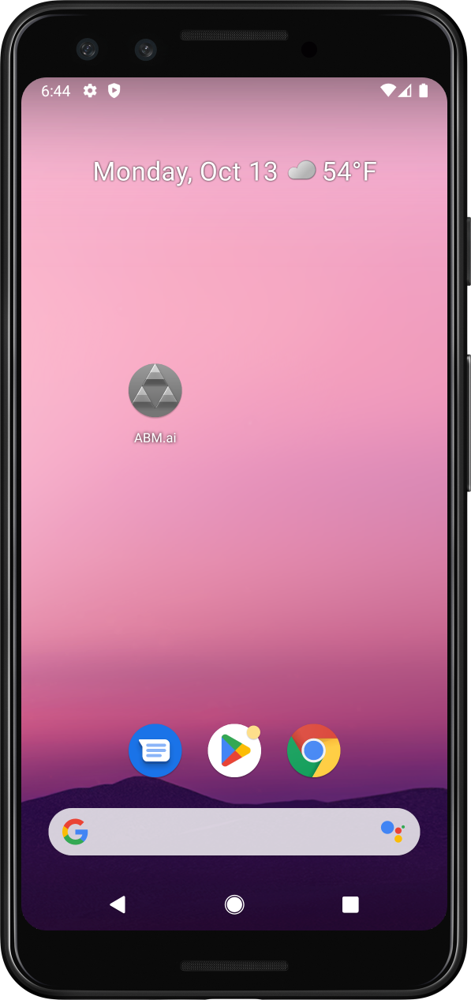
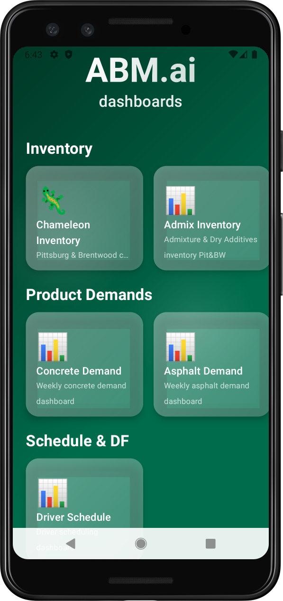

# ABM.ai - Android

> Real-time operational intelligence for asphalt, concrete, and materials management - Android Platform

**ABM.ai for Android** is the Android port of the native iOS application that brings your entire operations ecosystem to your mobile device. Access live inventory levels, demand forecasts, driver schedules, AI-powered tools, and plant control systems—all from one interface.

  
  

---
## 📱 Project Status
**Now Available for Android!**

The Android version is now functional and ready for testing. Download the latest release APK from the [Releases](https://github.com/davisdane2/ABMai-android/releases) page to install on your Android device.

## 📊 Dashboard Features
The Android version includes all features from the iOS application:
### Real-Time Dashboards

#### **Inventory Management**
- **Chameleon Inventory** - Real-time pigment tracking
- **Admix Inventory** - Admixture and dry additives monitoring
- **Inventory Submission** - Update inventory levels from anywhere

#### **Weekly Demand Analytics**
- **Concrete Demand** - Weekly concrete production forecasts
- **Asphalt Demand** - Asphalt production planning
- **AC Oil Demand** - Asphalt cement oil tracking
- **Powder Demand** - Cement, slag, and flyash monitoring
- **Raw Materials** - Combined material demand overview

#### **Operations & Scheduling**
- **Driver Schedule** - Real-time driver scheduling dashboard

#### **AI-Powered Tools**
- **Concrete Quote AI** - Instant AI-generated concrete quotes
- **Mix Design Assist** - AI-powered mix design recommendations

#### **Plant Control**
- **CHASCOmobile** - Plant control interface with VPN integration

## 📱 Platform Support

- **Target Android Version:** Android 11 (API 34)
- **Device Support:** Phones only, and maybe Tablets

## 📖 Source Material
Original iOS repository: https://github.com/davisdane2/ABMai

## 
This is a private enterprise application for Antioch Building Materials employees.
For issues or questions:
- Email: dane@antiochbuilding.com
- GitHub Issues: https://github.com/davisdane2/ABMai-android/issues

---

## 📄 License

This is a private enterprise application. All rights reserved.

Dashboard logos and icons are proprietary to:
- CEMEX LLC, Deister Machine Co., ASTEC Inc., CHASCO Automation

Built with:
- **Android Studio** by Google
- **Supabase** for backend infrastructure
- **Claude Code** for AI-assisted development
---
